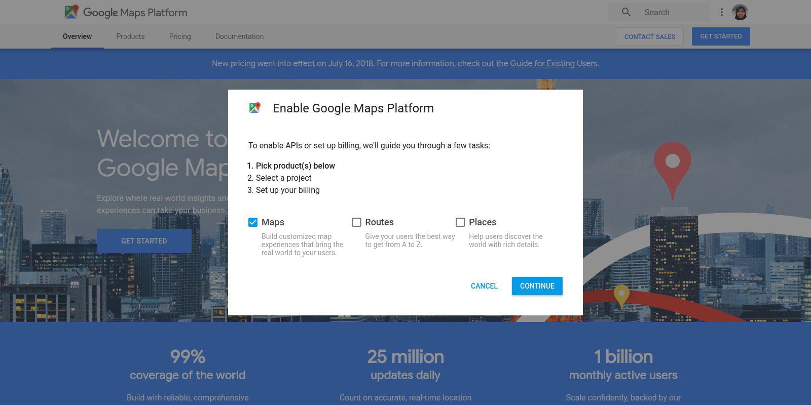
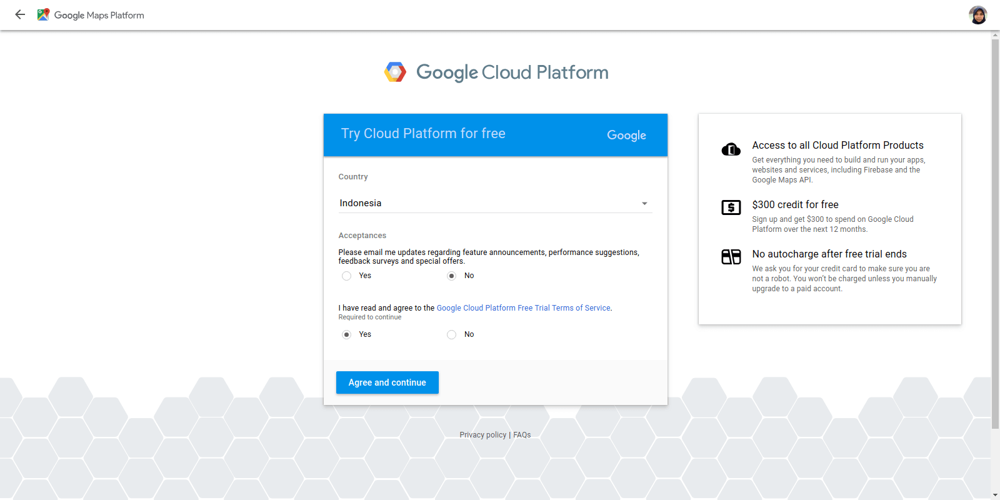
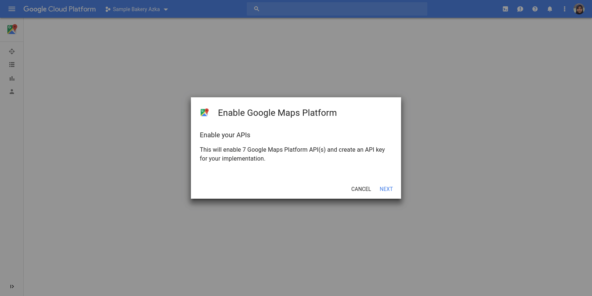

[Vue Google Maps](https://github.com/xkjyeah/vue-google-maps) is a Google maps component for vue with 2-way data binding.

## :key: Get API Key

1. Get an API key from the [Google Maps Platform](https://cloud.google.com/maps-platform/). Click **Get Started**.

2. Pick a product 

3. Select a project 

4. Create a billing account 

5. Accept the terms of service 

6. Create a payment profile 

7. Enable the API 

8. Get the API key 

## :footprints: Steps

1. Create a Nuxt project and install dotenv and Vue Google Maps.

```bash
npx create-nuxt-app nuxt-demo
cd nuxt-demo
npm i -D @nuxtjs/dotenv
npm i vue2-google-maps
```

2. Create a file named `.env` in the project root and paste your API key, e.g.:

```env
VUE_APP_GOOGLE_MAPS_API_KEY=ABcdEfGhIjklmNOpqrsTUvWXyzAbcD1EfGhiJKl
```

3. Create Google Maps plugin in `plugins/google-maps.js`.

<<< @/nuxt-demo/plugins/google-maps.js

4. Register the plugin in `nuxt.config.js`.

```js
export default {
  env: {
    VUE_APP_GOOGLE_MAPS_API_KEY: process.env.VUE_APP_GOOGLE_MAPS_API_KEY
  },
  modules: ["@nuxtjs/dotenv"],
  plugins: ["~/plugins/google-maps"]
};
```

5. Use Vue Google Maps, e.g. in `pages/google-maps.vue`.

<<< @/nuxt-demo/pages/google-maps.vue

## :book: Explanation

- Specify the map center with `center`.
- To make the map zoomed in, increase the `zoom` value.
- Available map types for `map-type-id`:
  - roadmap
  - hybrid
  - satellite
  - terrain
- Put markers in many locations with `gmap-marker`.
